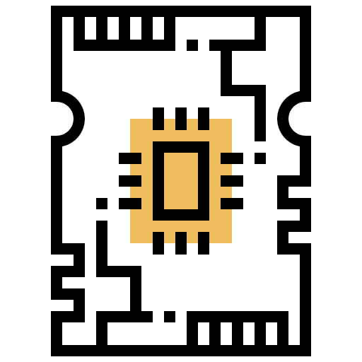

 

  

  <h3 align="center">ODE Solver</h3>

  

    Verilog implementation of an ordinary differential equation solver accelerator chip
  

## About The Project

Solving ordinary differential equations is a crucial part of modeling and simulating systems. It is used in order to model how a system state changes over time. Simulating models help us with designing systems and controllers. Solving an ODE analytically can be a very hard and sometimes impossible approach. Therefore, it is a common practice to solve ODE using approximation numerical methods. This project is a synthesizable Verliog implementation of a detailed low-level design of a chip that provides multiple solvers for an ODE. It is a stand-alone chip that reads the system’s data from the user, applies the chosen solver, and generates the output. Solving complicated systems ODEs can be very costly.

![ode-solver-design]

The chip is designed to solve the following equation:  

  

Where:  

- ![X] is a vector of size ![eq2] that represents the state of the system
- ![A] is a matrix of size ![eq3]
- ![U] is a vector of size ![eq4] that represents external input to the system
- ![B] is a matrix of size ![eq5]  

The chip consists of four main modules, IO module, forward Euler solver, interpolation module and step algorithm module.

- The IO module is responsible for loading the initial state of the system, the system parameters, and the solver options.
- The forward euler solver module is responsible for calculating ![X] of the next time step ![Xn1].
- The time step algorithm module is responsible for calculating the timer step depending on the chosen mode.
- The interpolation module is responsible for calculating ![U] at unknown timesteps.
- The coordinator orchestrates the execution of the chip through its different execution steps

[X]: Assets/X.png
[A]: Assets/A.png
[B]: Assets/B.png
[U]: Assets/U.png
[eq2]: Assets/eq2.png
[eq3]: Assets/eq3.png
[eq4]: Assets/eq4.png
[eq5]: Assets/eq5.png
[Xn1]: Assets/Xn1.png
[ode-solver-design]: Assets\ode-solver-design.png
